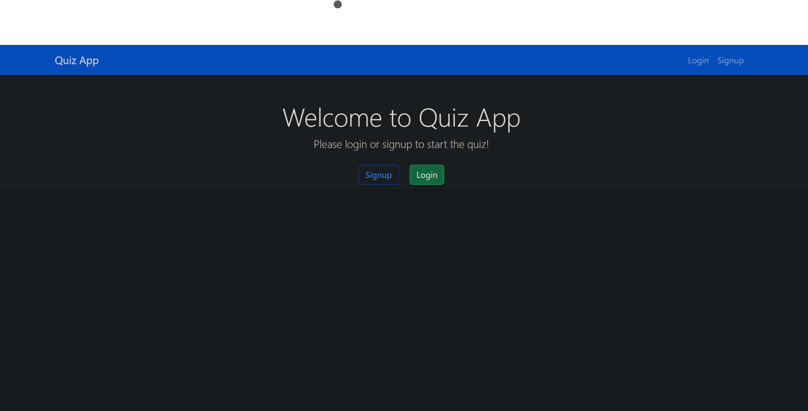
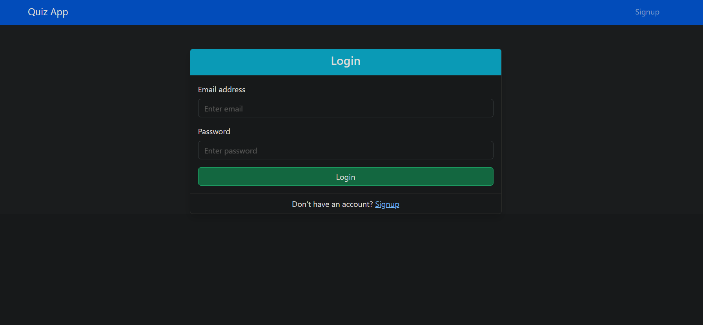
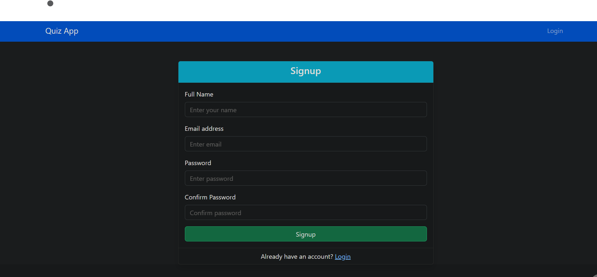
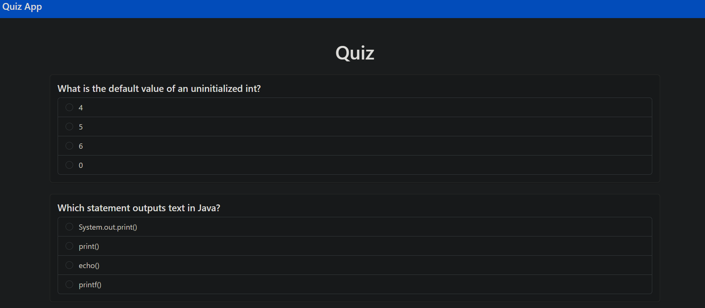
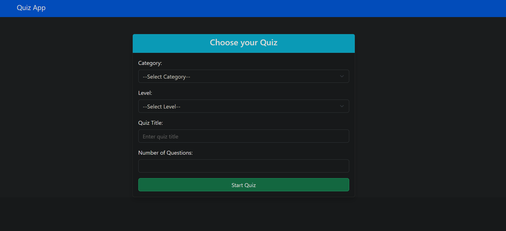

# Spring Boot Quiz App

A full-stack quiz application built using **Spring Boot** that allows users to take quizzes, manage questions, and handle authentication. This project is ideal for learning core Spring features like REST APIs, JPA, and Spring Security.

## 🚀 Features

- 🧠 Create and manage quizzes
- ❓ Add, update, delete questions
- 👤 User login system (Spring Security)
- 📄 REST API integration
- 📦 Maven-based project structure

## 🛠️ Tech Stack

- **Java 21**
- **Spring Boot**
- **Spring Data JPA**
- **Spring Security**
- **MySQL Database**
- **Maven**

## 📁 Project Structure
```
quizzapp/  
└── src/
└── main/
├── java/com/abin/quizzapp/
│ ├── controller/
│ ├── dao/
│ ├── dto/
│ ├── model/
│ ├── config/
│ └── QuizzappApplication.java
└── resources/
├── application.properties
```

## 🙋 Author
Abin<br>
Training to become a Java full-stack developer

## 🖼️ Screenshots

### 🏠 Homepage


### 🔐 Login Page


### 📝 Signup Page


### 🧠 Quiz Interface


### ❓Quiz Creation



